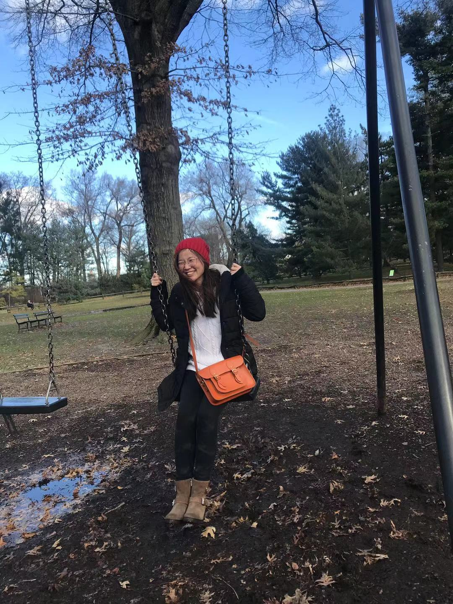

# Chao Li

  

  <!--  -->
  <!-- {: .align-right width="200"} -->
  
  Hi! I am a researcher turned data scientist, currently working at Pactera in the fraud detection and risk data science team. From a previous life I have a Ph.D in chemistry, where I studied crystal morphologies using molecular dynamics simulations. In particular my projects involved trying to understand the bending and twisting modes during early stage of crystal growths.

## Publications

* [Crystals of Benzamide, the First Polymorphous Molecular Compound, Are Helicoidal](https://onlinelibrary.wiley.com/doi/abs/10.1002/ange.202005738)   
  Alexander G Shtukenberg, Ran Drori, Elena V Sturm, Netta Vidavsky, Asaf Haddad, Jason Zheng, Lara A Estroff, Haim Weissman, Sharon G Wolf, Eyal Shimoni, **Chao Li**, Noalle Fellah, Efi Efrati, Bart Kahr  
  Angewandte Chemie, Aug 2020.

*   [Why Are Some Crystals Straight?](https://pubs.acs.org/doi/abs/10.1021/acs.jpcc.0c04258)  
  **Chao Li**, Alexander G Shtukenberg, Leslie Vogt-Maranto, Efi Efrati, Paolo Raiteri, Julian D Gale, Andrew L Rohl, Bart Kahr       
  The Journal of Physical Chemistry C, Jun 2020. 
  
* [Disorderly conduct of benzamide IV: crystallographic and computational analysis of high entropy polymorphs of small molecules](https://pubs.acs.org/doi/abs/10.1021/acs.cgd.0c00096)   
  Noalle Fellah, Alexander G Shtukenberg, Eric J Chan, Leslie Vogt-Maranto, Wenqian Xu, **Chao Li**, Mark E Tuckerman, Bart Kahr, Michael D Ward   
  Crystal Growth & Design, Mar 2020.
  
* [Timoshenko bending and Eshelby twisting predicted in molecular nanocrystals](https://pubs.acs.org/doi/abs/10.1021/acs.jpcc.8b08261)   
  **Chao Li**, Alexander G Shtukenberg, Damien J Carter, Xiaoyan Cui, Isabel Olson, Andrew L Rohl, Julian D Gale, Paolo Raiteri, Bart Kahr  
  The Journal of Physical Chemistry C, Oct 2018. 

* [A Supramolecular Ice Growth Inhibitor](https://pubs.acs.org/doi/abs/10.1021/jacs.6b08267)   
  Ran Drori, **Chao Li**, Chunhua Hu, Paolo Raiteri, Andrew L Rohl, Michael D Ward, Bart Kahr  
  Journal of the American Chemical Society, Oct 2016. 
  
 

## About me

Before joining NYU, I got my B.S in Materials Science from DongHua University. At NYU, I joined [MDI](https://www.nyumdi.com/), advised by [Bart Kahr](https://www.kahrlab.com/).

After Ph.D, I decided to switch my career to data science/machine learning and joined fraud detection and risk data science team at [Pactera](https://en.pactera.com/). I built rule-based as well as machine learning model-based risk systems for various microsoft's commercial products.

## Honors and Awards

* MacCracken Fellowship (By New York University)   
* National Scholarship (By Chinese Ministry of Education, awarded to Top 1 student of the department)  
* First Prize Scholarship of Shanghai (By Shanghai City Ministry of Education)   
* First Prize Scholarship (By Donghua University, three years in a row)  
* Outstanding Graduates Awards (By Shanghai City Ministry of Education)  

 

## Contact Information

<!-- email: chaoli930712 at gmail.com -->
